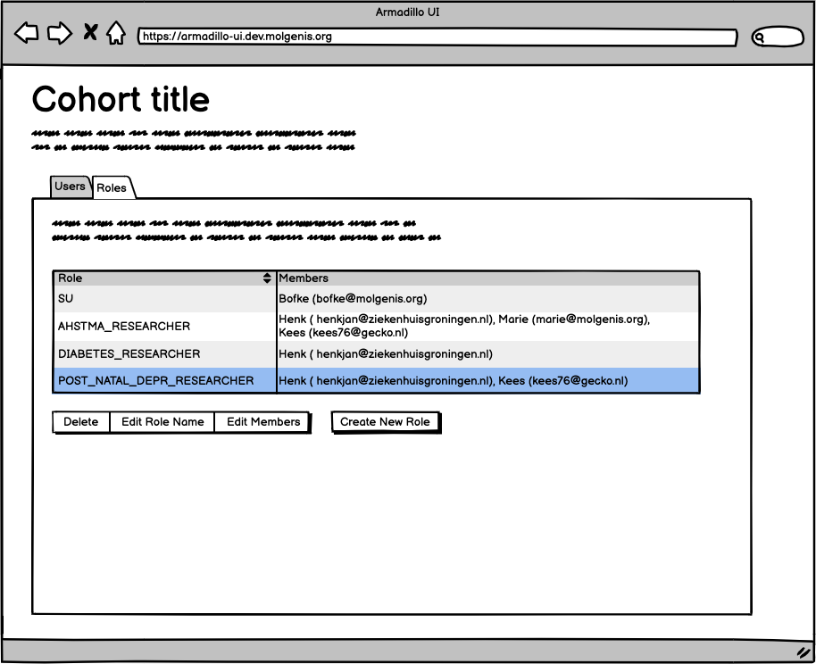

# Add roles to Armadillo users
The permission manager of the Armadillo allows you to manage and assign roles to the users that are part of your consortium.
## Users
When researchers need to perform research on you data you need to register them in the Armadillo.

To view all users registered in your Armadillo instance you will start in the screen below.

## Roles
When you created new folders in the Armadillo storage server, you need to create corresponding roles for the folders.

There are 2 types of roles:

- Superuser role
  Can access and manage all the data in the armadillo storage server
- Researcher role --> #folder_#RESEARCHER
  Can perform DataSHIELD analysis on the corresponding folder

*Examples*
Example folders in the Armadillo can be:

- all
- asthma
- diabetes

Example of roles for the folders should be:

- SU
  Superuser manages all the data present in the Armadillo  
- ASTHMA_RESEARCHER
  Can perform DataSHIELD analysis on the "asthma" folder
- DIABETES_RESEARCHER
  Can perform DataSHIELD analysis on the "diabetes" folder

The screenshot below shows the possible roles in this example.

### Add new roles
When you add new roles to the Aramdillo, you need to make sure that the new role is based on one of the folders in the Armadillo. So if you add a new folder:

- exampledata

The role for the researcher should be:

- exampledata_RESEARCHER

Adding new roles is easy.

## Managing users and roles
There are several ways to manage the roles. At this moment we support two perspectives.

- roles perspective
- user perspective
### Roles perspective
You can manage users per role in the roles perspective. You can easily edit members for each role.

## User perspective
The other way around is to view and manage users.

